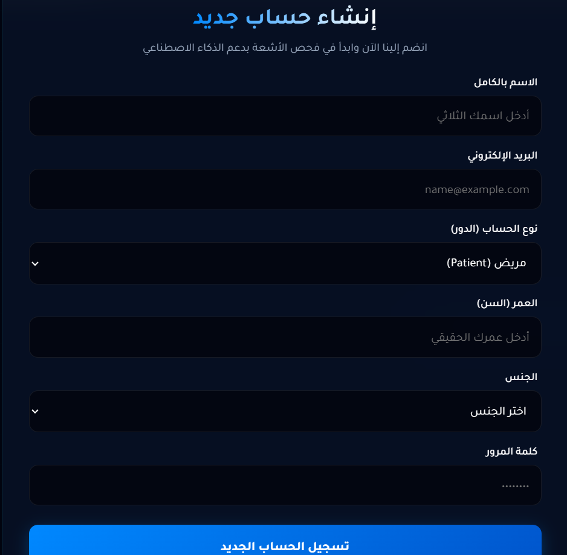
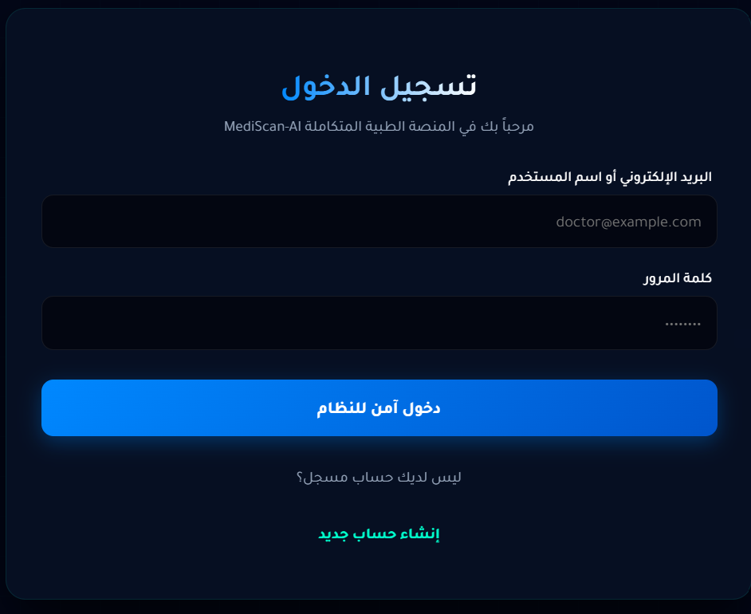
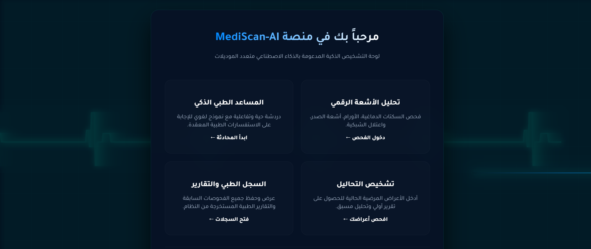
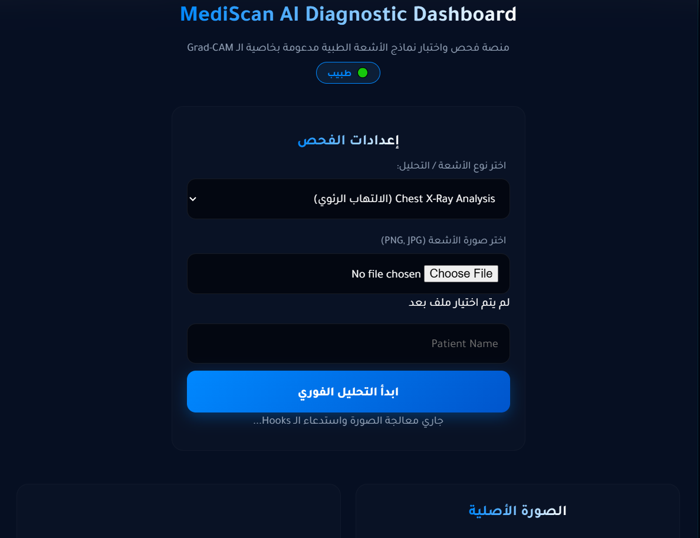
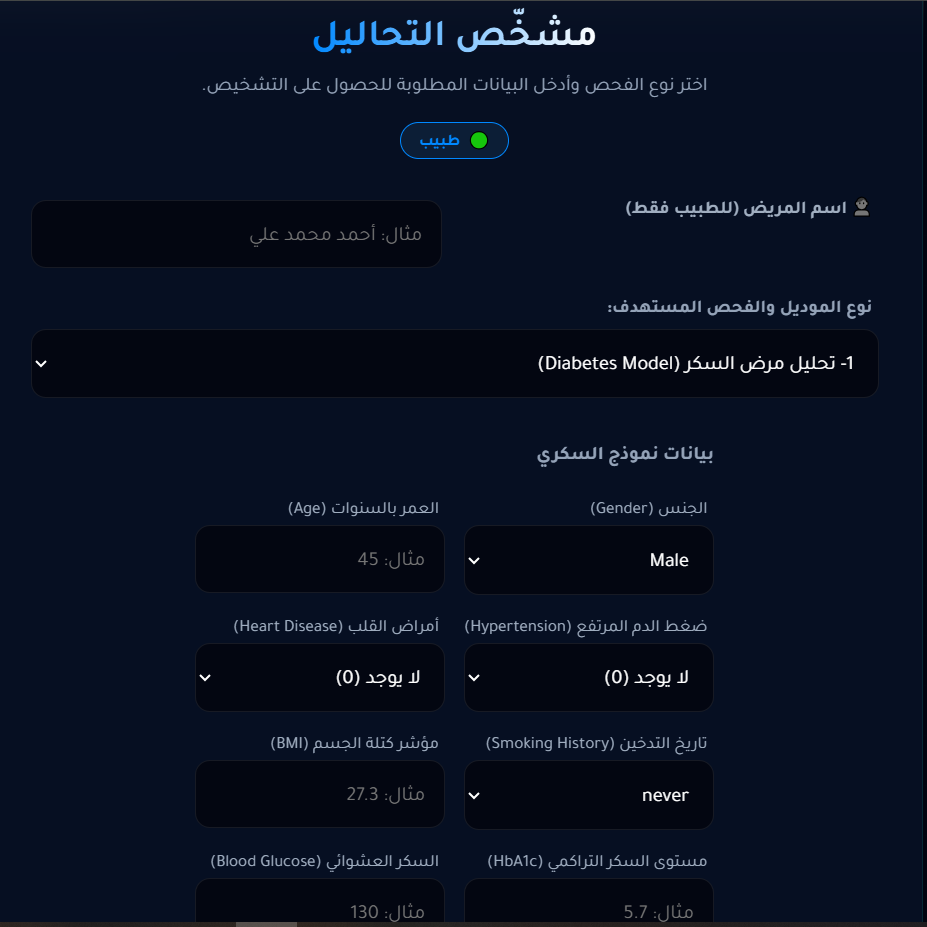
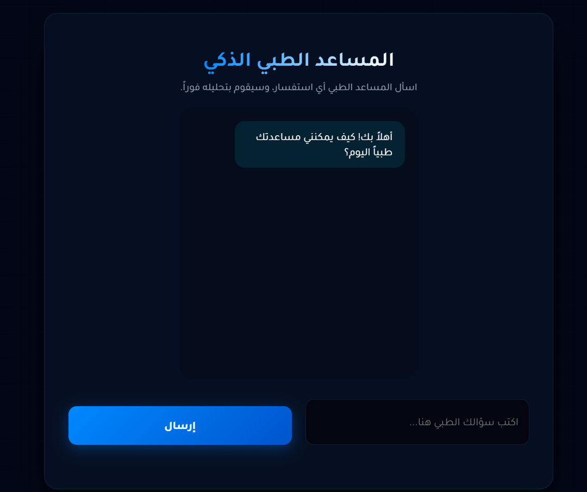
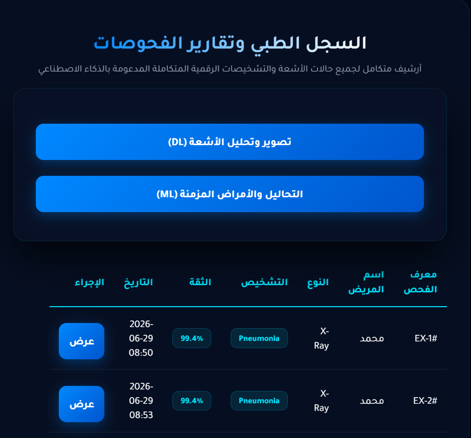
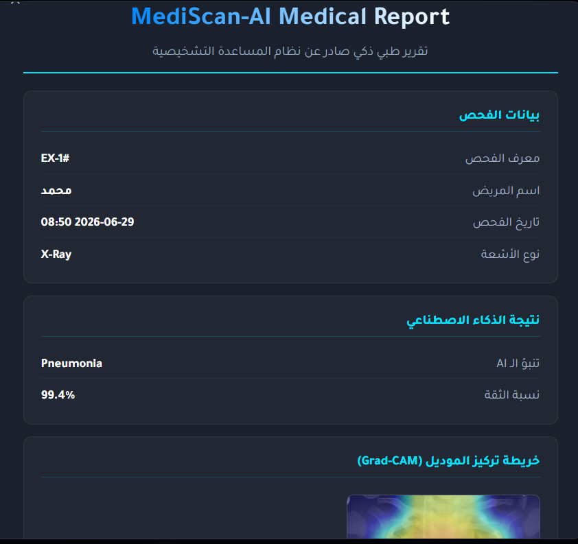
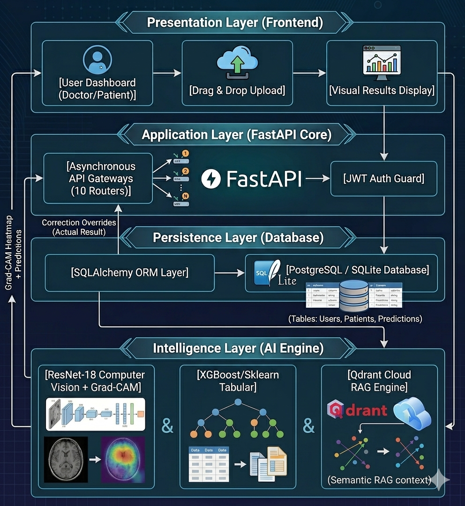

# MediScan AI 🩺
### Complete Technical & Operational Documentation

[](https://fastapi.tiangolo.com/)
[](https://www.docker.com/)
[](https://pytorch.org/)
[](https://qdrant.tech/)
[](https://www.netlify.com/)

---

## 1. Platform Overview

**MediScan AI** is a complete, end-to-end medical diagnostics platform powered by AI, engineered as a production-ready system rather than an isolated research experiment confined to a Jupyter Notebook.

**Core Goal:** Bridge the gap between deep learning research and real-world hospital workflows by solving three fundamental problems:

1. **The global radiologist shortage**, which causes diagnostic delays and backlogs of unreviewed scans.
2. **The "Black-Box" AI problem**, which prevents clinicians from trusting AI decisions due to the lack of visual interpretability.
3. **The absence of data persistence** in traditional tools, and their inability to track a patient's longitudinal medical history — combined with the challenge of **Clinical Data Drift** after deployment.

The platform unifies **6 diagnostic models** (computer vision + tabular data), a **visual interpretability system (Grad-CAM)**, a **continuous learning loop with clinician-in-the-loop feedback**, and an intelligent medical assistant built on **RAG**, all under a single, secure architecture.


---

## 2. Authentication Gateway (Login & Sign-Up)

Before accessing any section of the platform, every user must pass through a mandatory authentication gateway:

- **Login or Sign Up** for a new account.
- During registration, the user selects a **Role**: **Patient** or **Doctor**. This role is stored in the database and used to control access permissions throughout the system.
- The entire session is managed via **JSON Web Tokens (JWT)**: once login succeeds, the server issues a signed token that is attached to every subsequent request to verify identity and role, without re-sending credentials each time.
- This security guard is what enforces the distinction between roles — for example, the "correct a diagnosis" feature (detailed in the MLOps section below) is only available to a **Doctor** account, while a patient can only view their own results.


--



---

## Dashborad



## 3. The Four Core Sections of the Platform

Once authenticated, the platform is organized into 4 core sections:

### Section 1: Radiology Module 🩻

Contains **4 deep learning models** for computer vision, each producing a prediction accompanied by a Grad-CAM interpretability map:

| Model | Image Type | Objective |
|---|---|---|
| **Chest X-Ray** | X-Ray | Detect pneumonia |
| **Brain Tumor** | MRI | Classify tumors into 4 distinct neurological states |
| **Brain Stroke** | CT Scan | Classify slices into Normal / Ischemia / Bleeding |
| **Diabetic Retinopathy** | Retinal Fundus | Detect vascular damage caused by diabetes in the retina |
---




### Section 2: Lab Analysis Module 🧪

Contains **2 models** that operate on tabular data instead of images:

| Model | Data Type | Objective |
|---|---|---|
| **Diabetes Predictor** | Metabolic indicators | Predict the likelihood of diabetes onset |
| **CKD Staging** | Biomarkers (GFR, Blood Pressure, Creatinine, Oxalate...) | Classify kidney condition across 6 clinical stages |




### Section 3: Intelligent Medical Assistant (RAG System) 🤖

This is one of the most important components of the platform: a **medical chatbot** built on a **Retrieval-Augmented Generation (RAG)** architecture, specifically designed to eliminate hallucinations from the language model and rely solely on trusted medical sources.

- **Knowledge base:** The system connects to a cloud-scale **Qdrant Cloud Vector Database** containing over **156,000 verified medical context snippets**.
- **How it works:**
  1. The user's question is converted into a vector embedding.
  2. The system searches Qdrant for the most semantically relevant medical snippets.
  3. These snippets are passed as **context** to the language model, along with strict instructions (System Prompt) forcing it to answer **only** based on the retrieved context, without adding any information from its own "general knowledge."
- **Fine-tuning to prevent hallucination:**
  - The **System Prompt** was explicitly engineered to instruct the model not to answer at all if the answer isn't found in the retrieved context.
  - The **Temperature** is set to a very low value to reduce randomness and unwanted "creativity," making responses stick closely to the facts extracted from the database rather than being generated freely by the model.
- **Result:** A medical assistant that answers patient and doctor queries with high confidence, guaranteeing that every answer is grounded in a real medical reference rather than a model guess.




### Section 4: Medical History & Records Module 📋

- Displays **all** of a patient's previous diagnostic transactions — from both the Radiology and Lab Analysis modules — in a single unified timeline.
- Each record includes: the original image, the Grad-CAM heatmap (if applicable), the prediction, the confidence score, and the exam date.
- If the logged-in user is a **Doctor**, they can open any record and edit/confirm the actual result (`actual_result`) — this is the entry point for the **Human-in-the-Loop** mechanism described later.
- **PDF Report Export:** Users can generate a print-ready PDF report containing the full exam details (image, result, date, patient data), producing an official medical report that can be handed to the patient or archived.



<h2> PDF Report </h2>





---

## 4. System Design

The platform is built on a **decoupled 4-Tier Architecture**, ensuring a complete separation of concerns and easy future scalability.





### A. Presentation Layer (Frontend)

A responsive web interface built with **HTML5 + TailwindCSS + JavaScript**, responsible for:
- Rendering high-resolution medical images quickly.
- Live diagnostic state tracking.
- Clearly displaying visual interpretability outputs (Grad-CAM).

### B. Application Layer (APIs)

Powered by **FastAPI** as an asynchronous, high-throughput gateway, organized into **10 independent routers** to isolate each responsibility, such as:
- An authentication router (JWT).
- A dedicated router for each radiology and lab model.
- A router for the RAG assistant.
- A router for database and medical history management.

This separation ensures that adding or modifying a model never affects the rest of the system.

### C. Persistence Layer (Database)

- **SQLAlchemy ORM** acts as the intermediary layer for interacting with a local **SQLite** database.
- The database stores the Users, Patients, and Predictions tables, allowing every diagnostic transaction to be linked to a specific patient and their full longitudinal medical history to be tracked over time.

### D. Intelligence Layer (AI Engines)

A distributed execution layer combining multiple frameworks based on each model's nature:
- **PyTorch / TensorFlow:** run the computer vision models (radiology + Grad-CAM).
- **Scikit-Learn / XGBoost:** run the tabular models (diabetes and CKD).
- **Qdrant Cloud:** serves as the semantic search engine powering the RAG system.

### How the Four Layers Work Together

When a user uploads an image or submits lab data from the Frontend:
1. The request passes through the **JWT Auth Guard** at the API layer to verify identity and permissions.
2. The relevant router receives the data and forwards it to the appropriate **Intelligence Layer** engine (vision or tabular).
3. The model executes the prediction (and Grad-CAM, if it's a vision model), and the result is saved to **SQLite** via SQLAlchemy.
4. The full result (prediction + confidence score + heatmap, if applicable) is returned to the frontend and displayed instantly.
5. If a doctor later corrects the result, the new value is written directly into the `actual_result` field in the database, to be used later for model retraining.

---

## 5. Diagnostic Model Details (Full Results)

### A. Computer Vision Models (Deep Learning)

**1. Brain Stroke Classification (CT Scans)**
- **Objective:** Classify CT brain slices at the slice-level into 3 classes: Normal, Ischemia, Bleeding.
- **Data:** A total of 6,650 slices used for training and validation.
- **Performance:** **97.0% Accuracy** on a completely isolated test set of 998 slices.

**2. Diabetic Retinopathy Detection (Retinal Fundus)**
- **Objective:** Analyze retinal fundus images to detect vascular damage caused by diabetes.
- **Data:** A balanced dataset of 3,662 images.
- **Performance:** A stable **98.0% Accuracy**.

**3. Chest X-Ray Diagnostics (Pneumonia)**
- **Objective:** Scan chest radiographs to identify pulmonary infections.
- **Performance:** Overall accuracy of **88.1%**.
- **Clinical safety metric:** The model is optimized to achieve **99.7% Recall (Sensitivity)**, virtually eliminating the risk of false negatives to maximize patient safety — even at the cost of some overall accuracy.

**4. Brain Tumor Classification (MRI)**
- **Objective:** Classify MRI scans into 4 distinct neurological tumor states.
- **Architecture:** A custom **ResNet-18** vision backbone, trained specifically for this task.
- **Performance:** **81.2% Accuracy** and **92.2% AUC**.

### B. Tabular Predictive Models (Machine Learning)

**1. Chronic Kidney Disease (CKD) Staging**
- **Objective:** Analyze complex clinical biomarkers (GFR, Blood Pressure, Serum Creatinine, Urine pH, Oxalate) to assess kidney function.
- **Performance:** **99.0% Classification Accuracy** across 6 distinct clinical stages.

**2. Diabetes Predictor**
- **Objective:** Evaluate metabolic risk indicators to predict diabetes onset.
- **Architecture:** An optimized **XGBoost** gradient boosting pipeline.
- **Performance:** **96.4% Accuracy** validated on a dataset exceeding 19,000 records.

> 📸 *Suggested placement for Grad-CAM sample outputs from each of the four vision models*

---

## 6. Advanced MLOps Additions

### A. Explainable AI (XAI) via Grad-CAM

To eliminate the "black-box" risk that prevents doctors from trusting AI, all four vision pipelines embed **Grad-CAM (Gradient-weighted Class Activation Mapping)**:

- **How it works:** Within milliseconds of generating a prediction, the backend computes the gradients flowing into the model's final convolutional layer.
- **Output:** A dynamic heatmap is overlaid directly onto the original medical image, precisely highlighting the anatomical regions the model relied on to make its decision — allowing physicians to instantly audit the AI's clinical reasoning rather than blindly trusting the output number.

### B. Human-in-the-Loop MLOps Pipeline

To counter **Clinical Data Drift** (model performance degradation over time due to differences in equipment and patient populations):

- Every diagnostic transaction is logged into the local database with an initial predicted result.
- An authorized **Doctor** can review and manually correct any prediction through the system interface.
- The correction is written directly into the `actual_result` field in the database.
- Over time, this silently builds a verified, gold-standard dataset entirely within the hospital's local infrastructure — ready to be used for future model fine-tuning and retraining without violating any data privacy constraints.

### C. Clinical Knowledge Assistant (RAG Pipeline)

*(See Section 3 above for the full breakdown of the RAG system, knowledge base, and hallucination-prevention mechanisms.)*

---

## 7. Security & Local Data Design

- **JWT Guard:** All sensitive FastAPI endpoints are mandatorily protected by JSON Web Token authentication, enforcing role-based access (Doctor vs. Patient view) and protecting the patient's longitudinal health history.
- **Local Directory Automation:** Every vision module automatically executes the following on startup:
  ```python
  os.makedirs("static/uploads", exist_ok=True)
  ```
  This creates a permanent local storage folder on the host machine to store raw uploaded medical scans and the generated Grad-CAM heatmaps, ensuring zero multi-tenant cloud storage leakage.

---

## 8. Managed Hybrid Deployment Strategy

To deliver a live web application while preserving data privacy and low-latency local inference:

- **Frontend Deployment:** The presentation layer is hosted on high-availability cloud platforms (**Vercel / Netlify**), providing immediate web access from any device.
- **Backend & AI Engine Execution:** The FastAPI backend, local SQLite database, and deep learning model weights all run **locally** on the host machine, fully leveraging local **NVIDIA CUDA** acceleration for sub-second model execution.
- **The ngrok Bridge:** To bypass local firewalls without requiring a static public IP, an encrypted, high-speed tunnel is launched on the backend host:
  ```bash
  ngrok http 8000
  ```
  This exposes local port `8000` to a secure cloud URL (`https://xxxx-xxxx.ngrok-free.app`), and the Vercel-hosted frontend updates its `BASE_URL` to target this endpoint.
- **Full Data Flow:** When a user uploads a scan on the cloud frontend, the image travels through the encrypted ngrok tunnel straight to the local FastAPI backend, which saves it in `static/uploads`, runs the local PyTorch model, generates the Grad-CAM visualization, and streams the full diagnostic payload back to the browser instantly.

---

## 9. Technical Summary (Tech Stack)

| Layer | Technologies |
|---|---|
| Frontend | HTML5, TailwindCSS, JavaScript |
| Backend / API | FastAPI (Async, 10 Routers) |
| Authentication | JWT (Role-Based: Doctor / Patient) |
| Database / ORM | SQLite + SQLAlchemy |
| AI — Vision | PyTorch, TensorFlow, ResNet-18, Grad-CAM |
| AI — Tabular | Scikit-Learn, XGBoost |
| RAG / Vector DB | Qdrant Cloud (156K+ medical snippets) |
| Deployment | Vercel / Netlify (Frontend) + ngrok Tunnel + Local CUDA Backend |

---

## 10. Project Governance

| | |
|---|---|
| **Institution** | Delta Technology University (DTU) — Faculty of Information Technology |
| **Graduation Date** | June 2026 |
| **Academic Supervisor** | Dr. Mussad Wajih |
| **Lead** | Abdelwahab Amr |

  | **Team** | 

Abdelwahab Amr | AI & Bakend Engineer

Ahmed Saeed, | Data Base & ML Engineer

 Ahmed Elsayed | Front end Engineer

---

<p align="center"><i>MediScan AI — Delta Technology University, Academic Year 2024/2025</i></p>